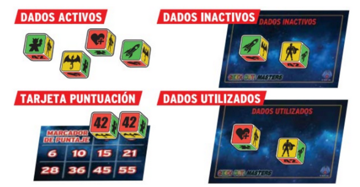
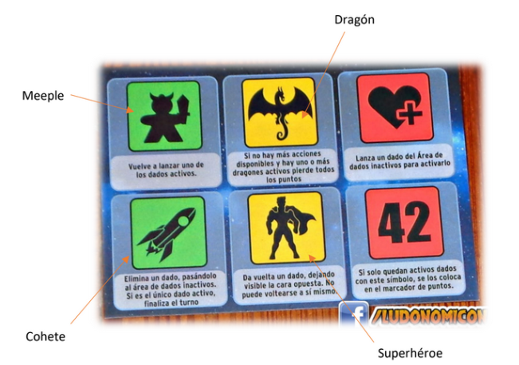

# Geek Out! Master

Geek Out Master es un juego en desarrollo hecho en Java como parte de un miniproyecto para la Universidad del Valle.

## Cómo jugar

El objetivo de este juego es conseguir la mayor cantidad de puntos juntando dados cuya
cara visible es la cara 42. Geek Out Masters no es solo suerte, también importa la estrategia
ya que una vez que se lanzan los dados TODAS las caras deberán ejecutarse, las caras
están dadas así:
- Los Meeples permiten relanzar los dados.
- Las Naves Espaciales eliminan un dado
- Los Superhéroes revelarán el lado oculto de la cara.
- Los Corazones nos brindarán un dado extra
- Los Dragones causan pérdida.
  El juego está compuesto por: ¡10 dados de Geek Out!, 1 ayuda memoria, 1 Tarjeta de
  puntuación.
  El área de juego está compuesta de 4 sectores (ver Figura 1):
1. Los dados activos.
2. Los dados Inactivos.
3. Los dados utilizados.
4. La tarjeta de puntuación.

   Figura 1. Zona de juego geek out master
   Igualmente, se cuenta con una ayuda explicativa de las acciones, es decir, como se debe
   interpretar cada cara del dado (ver figura 2)
   Cada una de las 6 caras de los dados tienen 1 dibujo que permite al jugador realizar 1
   acción especial:

(figura 1)

Igualmente, se cuenta con una ayuda explicativa de las acciones, es decir, como se debe
interpretar cada cara del dado (ver figura 2)
Cada una de las 6 caras de los dados tienen 1 dibujo que permite al jugador realizar 1
acción especial:
1. El Meeple permite relanzar otro dado en juego, es decir, de la sección dados activos.
2. La Nave Espacial envía un dado no usado (de la sección dados activos) a la sección
   de dados inactivos.
3. El Superhéroe permite que cualquier dado no usado (sección dados activos) sea
   volteado y colocado en su cara opuesta.
4. El corazón permite tomar un dado de la sección de dados inactivos y lanzarlo para
   que sea un nuevo dado activo.
5. El Dragón es la cara que se quiere evitar, ya que si al final de la ronda es el último
   dado activo que queda se habrán perdido todos los puntos ganados y acumulados.
6. 42 es la cara que permite sumar puntos al final de la ronda.
   Las caras contrarias del dado corresponden a sus colores, es decir, la cara contraría al
   Corazón es el 42, ya que tienen el mismo color (rojo); la cara contraria del Meeple es el
   Cohete o Nave Espacial y la cara contraria del Superhéroe es el Dragón.
   Figura 2. Tarjeta de acciones de geek out master
   Dinámica del juego:
   De los 10 dados que trae el juego se toman 3 y se colocan en el sector de "Dados

(figura 2)

## Funcionalidades

- Las caras de los dados son generados aleatoreamente.
- Cada cara permite activar un evento en las otras aras.
- El juego se tien un maximo de 5  rondas.
- El jugador acumula puntos por cada dado que tenga la cara (42) al final de cada ronda.
- El juego lleva un registro de los puntajes más altos.

## Contribuyentes

- José Erley Murillo
  *   e-mail federico.barbetti@correounivalle.edu.co
- Federico Barbetti
  *   e-mail jose.erley.murillo@correounivalle.edu.co

## Agradecimientos

Agradecemos a la Universidad del Valle por brindarnos la oportunidad de desarrollar este proyecto como parte de nuestra formación académica.

## Licencia

Geek Out Master es un proyecto de código abierto bajo la licencia MIT. Siéntete libre de utilizar y modificar el código como desees. Consulta el archivo LICENSE para más detalles.

¡Gracias por jugar Geek Out Master! Si tienes algún comentario o sugerencia, por favor contáctanos a través de nuestro correo electrónico.

